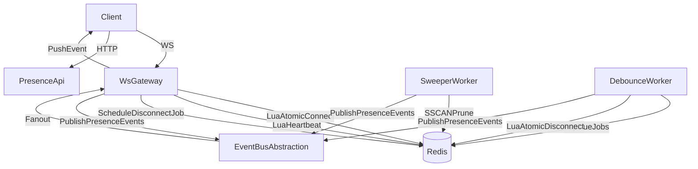

# Go User Presence Engine (v4) — Implementation Plan

## Goals

- Implement **Layers 1–2 (Connection + Reachability)** as the source of truth: **Online iff ≥1 live session within TTL**.
- Enforce **tenant isolation** via `scope_id` on every read/write.
- Guarantee **correct transitions** using Redis **Lua**: `online_users` updates only on true 0→1 and 1→0 transitions.
- Provide **bounded-latency cleanup** with a scalable **sweeper** (SSCAN + time budgets).
- Implement **debounced disconnect** as an **application-side scheduled job** (not a delayed event).
- Emit standardized **presence events** with fields needed for **dedupe + ordering**.
- Support **at-least-once delivery** with client-side deduplication via monotonic versions.

## Non-goals (for this reference build)

- Kubernetes/production deployment manifests.
- Availability states (`idle/away/...`) and context (`room/doc/...`) beyond placeholders.

## High-level architecture

## Repo layout (proposed)

- [`cmd/gateway/main.go`](cmd/gateway/main.go): WebSocket gateway + fanout subscriber
- [`cmd/api/main.go`](cmd/api/main.go): REST snapshot API (`GET /presence/online`, `POST /presence/lookup`)
- [`cmd/worker-sweeper/main.go`](cmd/worker-sweeper/main.go): SSCAN-based sweeper
- [`cmd/worker-debouncer/main.go`](cmd/worker-debouncer/main.go): scheduled disconnect executor
- [`internal/presence/service.go`](internal/presence/service.go): presence domain API
- [`internal/presence/keys.go`](internal/presence/keys.go): key naming + scope isolation
- [`internal/presence/lua/`](internal/presence/lua/): `connect.lua`, `heartbeat.lua`, `disconnect.lua`
- [`internal/events/`](internal/events/): event schema + publisher/subscriber interfaces
- [`internal/ws/`](internal/ws/): WS protocol (auth, heartbeat, subscribe, reconnect semantics)
- [`internal/auth/`](internal/auth/): JWT validation + scope authorization
- [`internal/config/`](internal/config/): env config parsing

## Data model (Redis)

Keys are always scoped:

### Core presence keys

- **Session**: `presence:session:{scope_id}:{session_id}` — opaque blob (JSON meta), **write-once at connect**, with **TTL=45s**. Heartbeats only call `EXPIRE`, never rewrite the value.
- **User sessions set**: `presence:user_sessions:{scope_id}:{user_id}` (SET of `session_id`)
- **Online users set**: `presence:online_users:{scope_id}` (SET of `user_id`)
- **User version**: `presence:user_version:{scope_id}:{user_id}` — monotonic counter, `INCR` on every online/offline transition (Lua). Included in events for client-side deduplication.

### Scope lifecycle

- **Active scopes index**: `presence:scopes` (SET of `scope_id`)
  - **Add**: Lua connect script calls `SADD presence:scopes {scope_id}` on first connect.
  - **Remove** (optional): Sweeper checks `SCARD presence:online_users:{scope_id}` after pruning; if 0, calls `SREM presence:scopes {scope_id}`. Stale empty scopes are harmless but will be cleaned up.

### Debounce jobs (application scheduler)

- **Job queue**: `presence:disconnect_jobs:{scope_id}` as **ZSET** (score=`run_at_unix_ms`, member=`{job_id}` UUID)
- **Job metadata**: `presence:disconnect_job_meta:{scope_id}:{job_id}` as **HASH** with fields: `user_id`, `session_id`, `created_at`. Set with **TTL=60s** (longer than debounce window + margin).
- **Cancellation index**: `presence:disconnect_job_index:{scope_id}:{user_id}:{session_id}` as **SET** of `job_id`. On reconnect, fetch all job_ids from this set, `ZREM` them from the queue, `DEL` the metadata hashes, then `DEL` the index set. This avoids O(N) scans and keeps cancellation O(1) per job.

### Sweeper cursor persistence

- **Sweep cursor (online_users)**: `presence:sweep_cursor:{scope_id}` — stores SSCAN cursor to resume iteration across ticks.
- **Sweep cursor (user_sessions)**: For user_sessions sets under ~1k members, restart from 0 each tick is acceptable. For larger deployments, optionally persist `presence:sweep_user_cursor:{scope_id}:{user_id}`.

## Lua scripts (atomic transitions)

Implement and load scripts via `SCRIPT LOAD` (cache SHA in-process):

- **Connect**: 
  1. `SETEX session` (write-once, never update value after)
  2. `SADD user_sessions`
  3. `SCARD user_sessions`
  4. If count == 1 → `SADD online_users`, `SADD presence:scopes {scope_id}`, `INCR user_version`
  5. Return `{transition: "online"|"none", version: <current_version>}`

- **Heartbeat**: 
  1. `EXISTS session`
  2. If exists → `EXPIRE session TTL`, return `OK`
  3. If not exists → return `UNKNOWN`

- **Disconnect** (best-effort): 
  1. `DEL session`
  2. `SREM user_sessions`
  3. `SCARD user_sessions`
  4. If count == 0 → `SREM online_users`, `INCR user_version`
  5. Return `{transition: "offline"|"none", version: <current_version>}`

## WS + HTTP contract

### HTTP snapshot — Admin/Debug

- `GET /presence/online?scope_id=...&cursor=...&count=...`
- Validates JWT → verifies user has access to `scope_id` (scope_id from query param **must match JWT claims/membership**)
- Uses `SSCAN` on `presence:online_users:{scope_id}` with pagination params
- Returns `{ users: [...], cursor: "..." }`
- **Use case**: Admin dashboards, "who's online now" screens, debugging

### HTTP snapshot — UI Lists (Primary)

- `POST /presence/lookup`
- Body: `{ scope_id: "...", user_ids: ["user1", "user2", ...] }`
- Validates JWT → verifies user has access to `scope_id`
- Returns `{ statuses: { "user1": "online", "user2": "offline", ... } }`
- **Use case**: Team member lists, assigned user presence, any UI showing presence for a known subset of users. This is the **primary snapshot endpoint** for typical UI integrations.

### WebSocket

- Endpoint: `GET /ws?scope_id=...` (JWT in header/cookie)
- **Security**: `scope_id` from query param **must match JWT claims/membership**. Never trust client-provided scope blindly.
- Server subscribes client to `presence:scope:{scope_id}` (via EventBus)
- Client sends heartbeats every ~15s with jitter; server calls Lua heartbeat
- **Heartbeat rate limiting**: Enforce max 1 heartbeat per 5s per connection to protect Redis from misbehaving clients.
- If heartbeat returns `UNKNOWN`:
  1. Server sends `{"type": "reconnect_required", "reason": "session_expired"}` message
  2. Server closes WebSocket with application close code (e.g., 4001)
  3. Client must reconnect and re-snapshot

### Presence event schema

Define a single canonical struct in [`internal/events/schema.go`](internal/events/schema.go):

- `event_id` (uuid-v4)
- `scope_id`
- `type` (`user_online|user_offline`)
- `user_id`
- `version` — monotonic per-user counter from `presence:user_version`. Clients apply events only if `version > last_seen_version` for that user.
- `occurred_at` (RFC3339 UTC)
- (optional) `source` (`gateway|sweeper|debouncer`) for debugging

### Event ordering semantics

**Ordering is best-effort.** Distributed publishers (gateway, sweeper, debouncer) do not guarantee total order. The event bus abstraction provides no ordering guarantees.

Clients must:
1. Apply events using the `version` field: only update local state if `event.version > local_version[user_id]`.
2. Rely on **snapshot reconciliation** for consistency: periodically or on reconnect, re-fetch via `/presence/lookup` and reset local state.

Duplicate events may occur (e.g., sweeper and debouncer both emit `user_offline` for the same user due to timing). This is acceptable with at-least-once semantics; clients must tolerate duplicates via version checking.

## Debounce behavior (anti-flicker)

- On WS close: **do not** run atomic disconnect immediately.
- Instead:
  1. Generate `job_id` (UUID)
  2. `ZADD presence:disconnect_jobs:{scope_id} {run_at_unix_ms} {job_id}`
  3. `HSET presence:disconnect_job_meta:{scope_id}:{job_id} user_id {user_id} session_id {session_id} created_at {now}`
  4. `EXPIRE presence:disconnect_job_meta:{scope_id}:{job_id} 60`
  5. `SADD presence:disconnect_job_index:{scope_id}:{user_id}:{session_id} {job_id}`

- **Cancellation** (on reconnect for same user/session):
  1. `SMEMBERS presence:disconnect_job_index:{scope_id}:{user_id}:{session_id}` → get all pending job_ids
  2. For each job_id: `ZREM presence:disconnect_jobs:{scope_id} {job_id}`, `DEL presence:disconnect_job_meta:{scope_id}:{job_id}`
  3. `DEL presence:disconnect_job_index:{scope_id}:{user_id}:{session_id}`

- **Execution** (debouncer worker):
  1. `ZRANGEBYSCORE presence:disconnect_jobs:{scope_id} -inf {now} LIMIT 0 100` → get due jobs
  2. For each job_id:
     - `HGETALL presence:disconnect_job_meta:{scope_id}:{job_id}` → get user_id, session_id
     - If meta missing (TTL expired or cancelled), skip
     - Execute Lua disconnect for that session
     - If returns `offline`, emit `user_offline` event with version
     - `ZREM`, `DEL meta`, `SREM from index` (cleanup)

## Sweeper (zombie cleanup)

- Runs every 30–45s.
- Iterates scopes from `presence:scopes`.

### Per-scope processing with time budgets

- **Time budget**: 50–200ms wall time per scope per tick. Configurable via env var.
- **Cursor persistence**: Load `presence:sweep_cursor:{scope_id}` at start of scope iteration. After each SSCAN batch, update the cursor. If budget exhausted, save cursor and stop; resume next tick.

### Sweep logic

For each scope:
1. Load cursor from `presence:sweep_cursor:{scope_id}` (default "0")
2. `SSCAN presence:online_users:{scope_id} {cursor} COUNT 100`
3. For each `user_id` in batch:
   - `SMEMBERS presence:user_sessions:{scope_id}:{user_id}` (or SSCAN for large sets)
   - For each `session_id`: check `EXISTS presence:session:{scope_id}:{session_id}`
   - If missing: `SREM presence:user_sessions:{scope_id}:{user_id} {session_id}`
   - After checking all sessions: `SCARD presence:user_sessions:{scope_id}:{user_id}`
   - If count == 0: `SREM presence:online_users:{scope_id} {user_id}`, `INCR user_version`, emit `user_offline` with version
4. Update `presence:sweep_cursor:{scope_id}` with new cursor
5. If cursor == "0" (full scan complete): optionally check `SCARD presence:online_users:{scope_id}`, if 0 then `SREM presence:scopes {scope_id}` (scope lifecycle cleanup)
6. Check elapsed time; if budget exceeded, stop and resume next tick

## Event bus (local reference)

- Default implementation: **Redis Pub/Sub**
- Publish to `presence:scope:{scope_id}`
- Gateway subscribes to that channel and fans out to connected clients
- **Backpressure**: Gateway fanout must handle slow consumers. Options:
  - Drop events for connections with full write buffers
  - Close connections that fall too far behind (e.g., >100 pending events)
  - This prevents one slow browser tab from building unbounded memory on the server
- Provide interfaces so production can swap to NATS/Kafka later without touching domain logic.

## Security considerations

- **Scope authorization**: `scope_id` from query params or request body **must be validated against JWT claims**. The server must verify the user has membership/access to the requested scope. Never trust client-provided scope values without validation.
- **Rate limiting**: 
  - Per-connection heartbeat rate limit (max 1 per 5s)
  - Consider per-user connection limits to prevent resource exhaustion
- **Input validation**: Validate all user_id, session_id, scope_id formats before using in Redis keys to prevent injection.

## Observability (minimal but production-shaped)

- Structured logs with request/session identifiers: `scope_id`, `user_id`, `session_id`, `event_id`.
- Metrics:
  - Heartbeat OK/UNKNOWN counts
  - Online/offline transitions (by source: gateway/sweeper/debouncer)
  - Sweeper: prunes per tick, time budget usage, cursor progress
  - Debouncer: executed/cancelled jobs, queue depth
  - Gateway: active connections, event fanout latency, dropped slow consumers

## Validation & testing

- Unit tests:
  - key-building + scope isolation
  - event schema serialization
  - version comparison logic
- Integration tests (recommended): run against a real Redis (local or testcontainer) to validate:
  - Lua transition correctness and version increments
  - Debouncer scheduling/cancellation/execution
  - Sweeper pruning semantics and cursor persistence
  - Duplicate event scenarios and version-based deduplication

## Local developer experience

- Provide a minimal [`README.md`](README.md) with:
  - How to start Redis
  - Run `gateway`, `api`, `worker-sweeper`, `worker-debouncer`
  - A tiny example client (optional) that connects, heartbeats, and prints events
  - **Failure modes and reconciliation expectations**:
    - What happens if sweeper is slow/stopped
    - What happens if debouncer is delayed
    - How clients should handle reconnection
  - **Event ordering semantics**: Document that ordering is best-effort, clients must use version field, duplicates may occur and must be tolerated

## Milestones

- M1: Redis keys + Lua scripts (with version increment) + Go presence service wrapper
- M2: WS gateway (connect + heartbeat with rate limiting + fanout with backpressure + reconnect_required on UNKNOWN)
- M3: HTTP snapshot API (GET /presence/online + POST /presence/lookup)
- M4: Debounce worker (schedule/cancel via index/execute with proper cleanup)
- M5: Sweeper worker (SSCAN + time budgets + cursor persistence + scope lifecycle cleanup)